# SPAN Contour Processing

The span_contour_processing repository is part of the processing pipeline 
for real-time magnetic resonance imaging of speech production.
The span_contour_processing repository processes the outputs of the 
[span_segmentation](https://github.com/usc-sail/span_segmentation) repository.
The outputs of the span_contour_processing repository are used by the
[span_articulatory_strategies](https://github.com/usc-sail/span_articulatory_strategies) repository
to obtain biomarkers of articulator synergies and by the 
[span_synthesis](https://github.com/usc-sail/span_synthesis) repository 
to synthesize speech based on the real-time magnetic resonance imaging data.

## Authors

Tanner Sorensen  
Signal Analysis and Interpretation Laboratory  
University of Southern California  
Los Angeles, CA

Asterios Toutios  
Signal Analysis and Interpretation Laboratory  
University of Southern California  
Los Angeles, CA


## Dependencies

+ MATLAB
+ MATLAB Statistics and Machine Learning Toolbox
+ `wget` (on Mac OSX, install using homebrew with `brew install wget`)

## Demo

Execute the demo with the Bash command

```bash
./demo/run.sh
```

A Matlab figure window will appear.

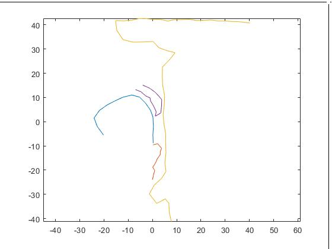

Click on the superior margin of the nasopharynx 
and the inferior margin of the hypopharynx. 

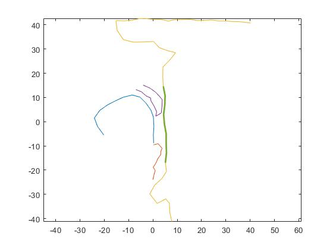

Enter `y` into Matlab command prompt to accept, 
or enter `n` to click again.

Guided factor analysis produces figures for each factor.

| 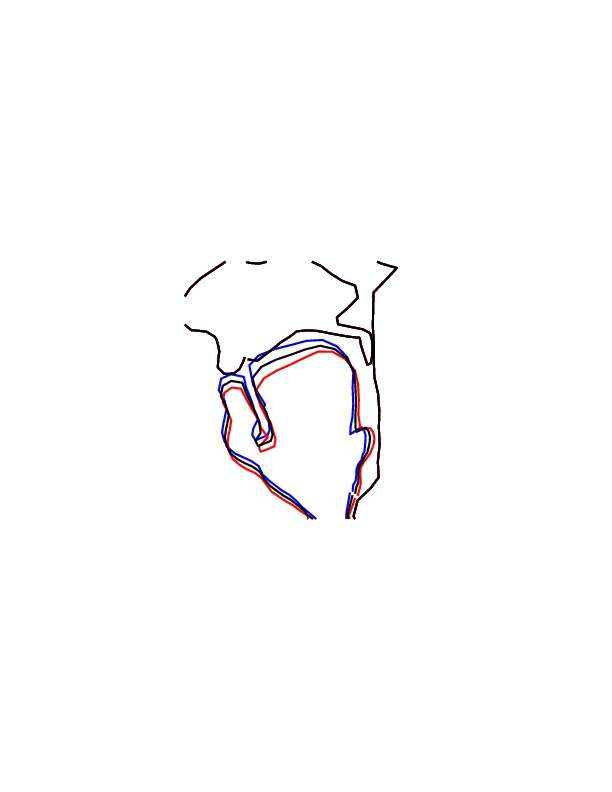 | 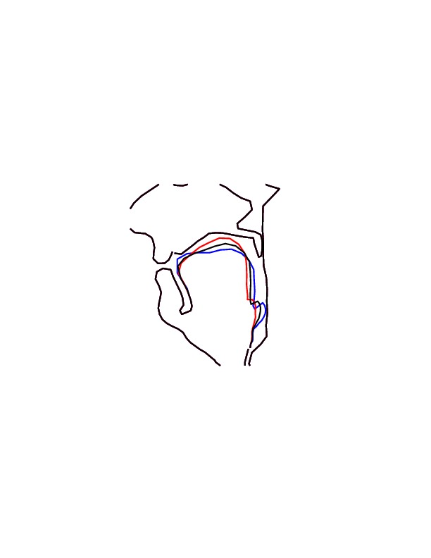 | 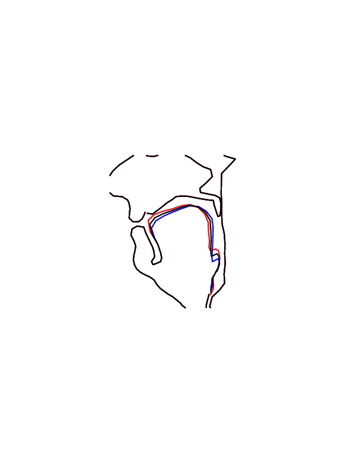 |  | 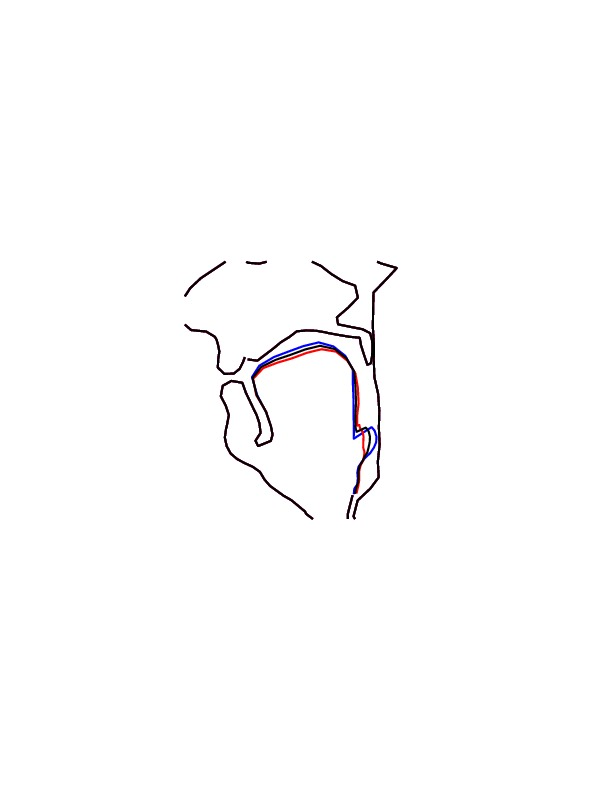 |
| :--- | :--- | :--- | :--- | :--- | 
| jaw | tongue 1 | tongue 2 | tongue 3 | tongue 4 |
| 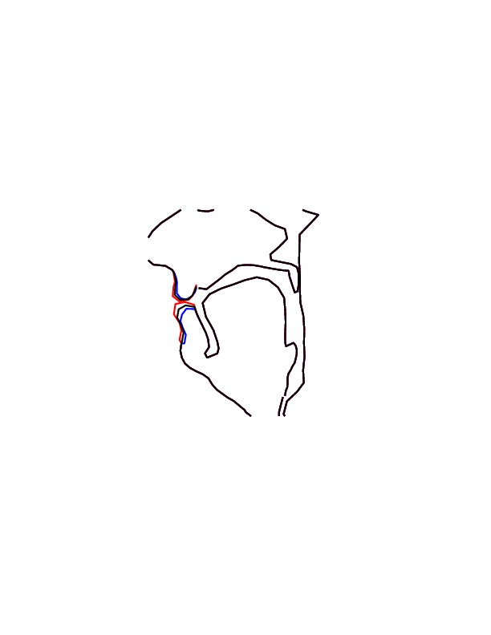 | 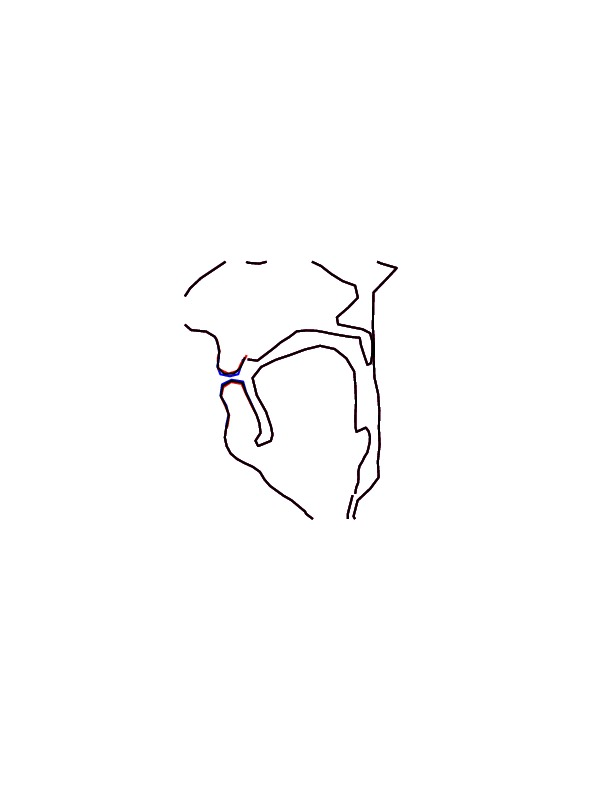 | 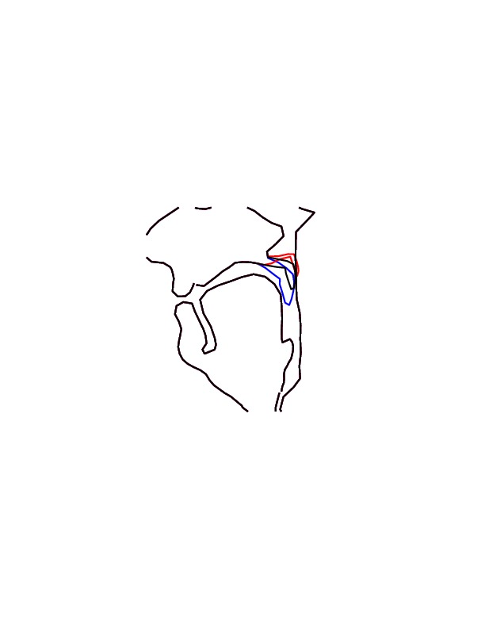 | 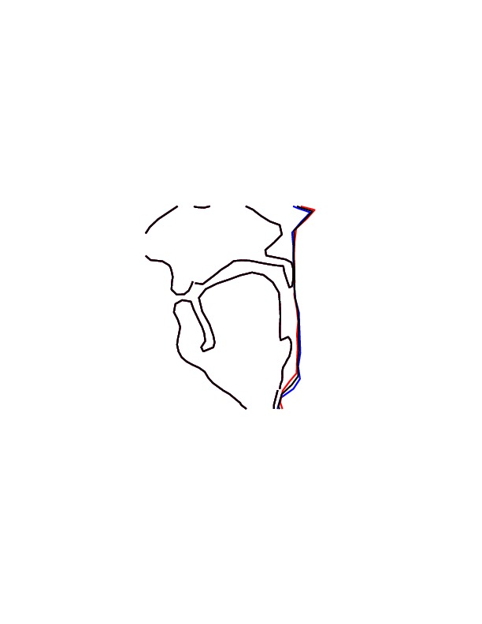 | 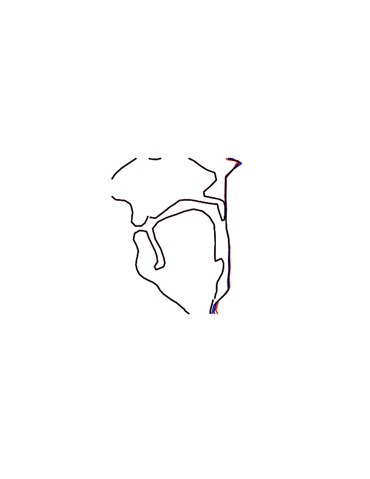 |
| lips 1 | lips 2 | velum | pharynx 1 | pharynx 2 |
